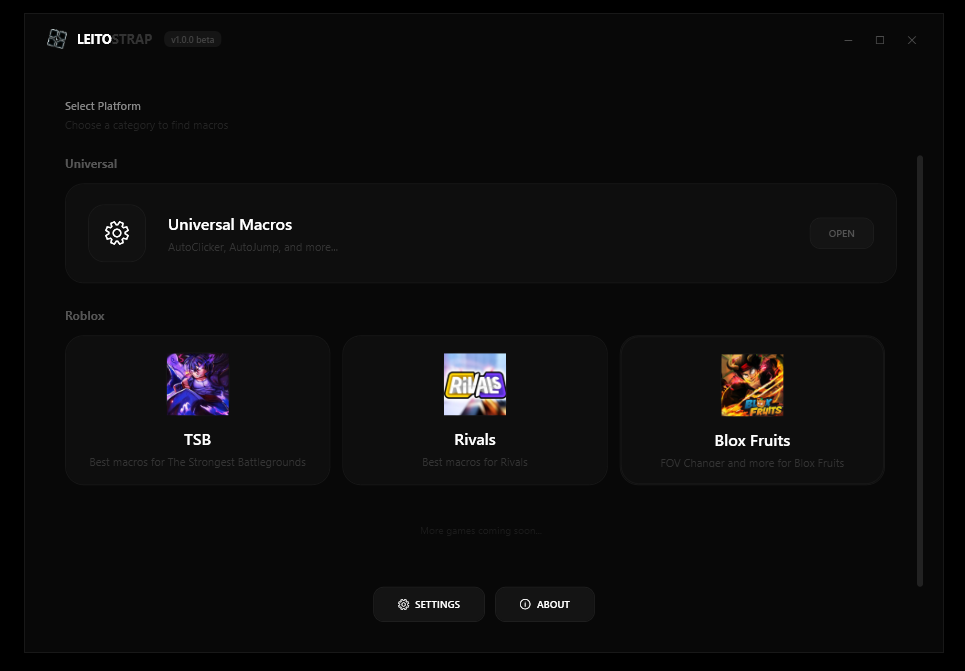

<h1>🎮 Leitostrap Macro</h1>

<em>High-performance game macro utility for Roblox and Windows games — built for competitive players.</em>

 

---

## 📖 Overview

**Leitostrap Macro** is a sleek, low-latency macro tool built with WPF (.NET 6) designed for Roblox and competitive Windows gaming. It features a fully custom black-and-white UI with per-game macro sections, hotkey binding, theming support, and potato mode for low-end PCs.

---

## 🕹️ Macros by Game

### 🏆 The Strongest Battlegrounds (TSB)

| Macro | Description |
|-------|-------------|
| **Humbled Twisted** | Precision combo script with camera-assisted flick |
| **Instant Lee** | Instantaneous Lee combo with configurable key |
| **Lethal Dash** | Automated lethal dash with sensitivity tuning |

---

### 🎯 Rivals

| Macro | Description |
|-------|-------------|
| **Bunny Hop** | Continuous jump spam for bhop movement |
| **Pillar Slide** | Forward and backward pillar slide with separate keys |

---

### 🍎 Blox Fruits

| Macro | Description |
|-------|-------------|
| **Auto Combo** | PVP combo automator — spam Melee, Fruta, Espada & Gun skills in order. Configurable keys (Z/X/C/V/F), hotbar slots, and activation key |
| **FOV Changer** | Modify Field of View from 70 (default) up to 120 |

---

### 🌐 Universal

| Macro | Description |
|-------|-------------|
| **AutoClicker** | Ultra-fast click automation up to 1000 CPS with configurable hold key |
| **AutoJump** | Continuous jump with configurable delay and hold key |

---

## ⚙️ Settings & Features

| Feature | Description |
|---------|-------------|
| 🥔 **Potato Mode** | Disables all animations for maximum performance on low-end PCs |
| 📌 **Always on Top** | Keeps Leitostrap Macro above all other windows |
| 🔔 **Notifications** | Toggle in-app popups when macros activate/deactivate |
| 🎨 **Static Themes** | 23 static color themes for the entire UI |
| 🌀 **Animated Themes** | 25 animated background themes |
| 🔑 **Hotkey Binding** | Custom key binding for every macro via a modal key picker |

---

## 🖥️ System Requirements

- **OS:** Windows 10 / 11 (x64)
- **.NET Runtime:** .NET 6.0 Desktop Runtime (Windows)
- **RAM:** 256 MB minimum
- **Resolution:** 1280x720 or higher recommended

---

## 🚀 Installation

1. Download the latest release from the [Releases](#) page.
2. Extract the `.zip` file.
3. Run **`Leitostrap Macro V1.0.0 Beta.exe`** — no installation required.
4. (If prompted) Install [.NET 6.0 Desktop Runtime](https://dotnet.microsoft.com/en-us/download/dotnet/6.0).

> **Note:** Some macros use `keybd_event` and `mouse_event` WinAPI calls. Windows Defender or antivirus may flag the executable. This is a false positive — the code is open source and only sends inputs to your game window.

---

## 👥 Team

| Role | Name |
|------|------|
| 👑 **Owner** | Leito |
| 🛠️ **Developer** | Dem |
| 🛠️ **Developer** | Sword |
| 🛠️ **Developer** | Pepper |
| 🛠️ **Developer** | Winnie |
| 🛠️ **Developer** | Lean |

---

## 📄 License

This project is private and not open for redistribution without explicit permission from the owner.

---

Made with ❤️ by the Leitostrap Team

